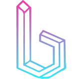
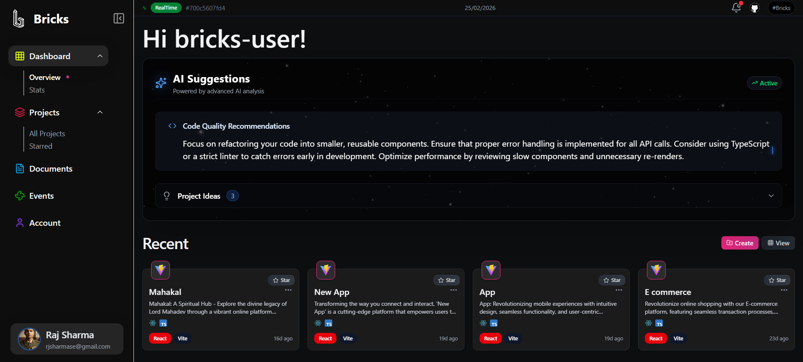
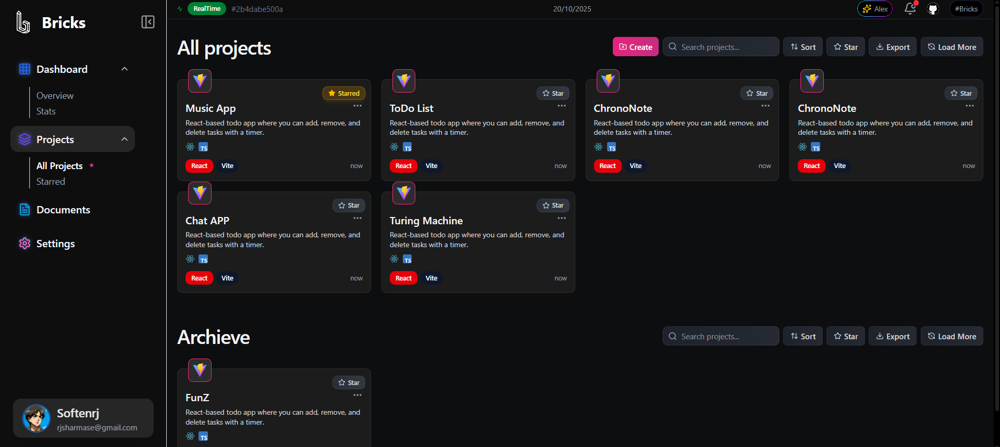
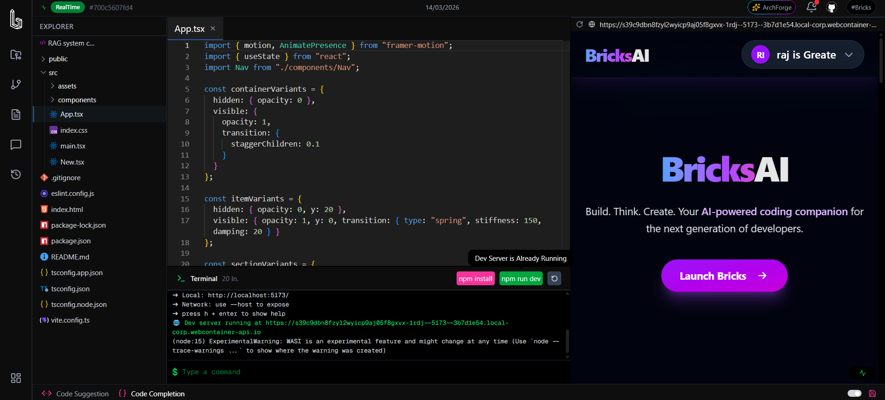
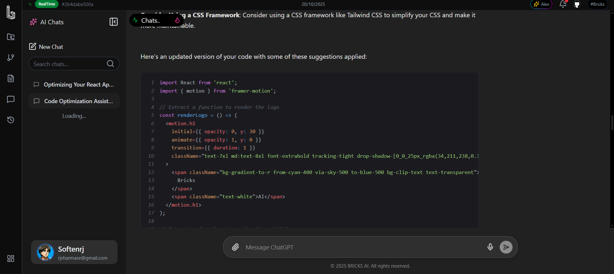

# 🚀 BRICKS AI

<h2>Transform Ideas into Code — Instantly</h2>

<em>Revolutionary AI-powered IDE that turns voice, text, and images into functional applications directly in your browser.</em>

[🌐 Live Demo](https://bricks-ai.vercel.app) • [📸 Demo Images](#demo-images) • [📖 Documentation](#) • [💬 Discord](#)

---

## ✨ What Makes BRICKS AI Special?

BRICKS AI revolutionizes software development by bridging the gap between imagination and implementation. Our cutting-edge platform empowers developers, designers, and innovators to create sophisticated applications through intuitive, multi-modal inputs.

### 🎯 Core Innovation
- **Multi-Modal Intelligence**: Seamlessly process voice commands, natural language descriptions, and visual sketches ( i dev phase )
- **Instant Prototyping**: Generate production-ready codebases in seconds, not hours
- **Zero-Setup Development**: Full-stack development environment running entirely in your browser
- **Collaborative Ecosystem**: Real-time teamwork with live editing and instant feedback

### 🛠️ Professional Development Suite
- **Advanced Code Editor**: Monaco Editor with intelligent code completion and syntax highlighting
- **Integrated Terminal**: Execute commands and run scripts directly in the browser
- **Live Preview**: Instant visual feedback as you code

---

## 📸 Demo Images

### ✨ Screenshots & Previews

<table>
  <tr>
    <td align="center">
      
       <b>Dashboard</b>
    </td>
    <td align="center">
      
       <b>All Projects</b>
    </td>
    <td align="center">
      
       <b>Code IDE</b>
    </td>
  </tr>
  <tr>
    <td align="center">
      
       <b>Project Chat</b>
    </td>
    <td align="center">
      
       <b>Context Tree</b>
    </td>
    <td></td>
  </tr>
</table>

<em>✨ Explore BRICKS AI in action through our modern visual gallery</em>

---

## 🌟 Key Features

### 🤖 AI-Powered Development
- **Natural Language Processing**: Describe your app in plain English
- **Voice-to-Code**: Speak your ideas and watch them materialize ( in dev phase )
- **Image Recognition**: Upload wireframes or sketches for instant conversion ( in dev phase )
- **Smart Suggestions**: AI-driven recommendations for code optimization

### ⚡ Performance & Scalability
- **WebContainer Technology**: Node.js runtime in the browser
- **Real-Time Collaboration**: Multi-user editing with conflict resolution
- **Cloud-Native Architecture**: Scalable infrastructure for enterprise use

### 🎨 Design & User Experience
- **Modern UI/UX**: Beautiful, intuitive interface designed for productivity
- **Responsive Design**: Perfect experience across all devices
- **Dark/Light Themes**: Comfortable coding in any environment
- **Accessibility First**: WCAG compliant for inclusive development

---

## 🚀 Getting Started

### Quick Start
1. **Visit** [bricks-ai.vercel.app](https://bricks-three-rose.vercel.app)
2. **Sign Up** with your preferred authentication method
3. **Start Creating** - Choose your input method and begin building

## 🏗️ Architecture & Technology

### 🏗️ Tech Stack

#### Frontend Excellence

#### Development Environment

#### Backend & Infrastructure

### 🔒 Backend Architecture
**Note:** The BRICKS AI backend (`bricks-backend`) is proprietary and closed-source. However, you can independently interact with our provided APIs.

---

## 🎉 Why Choose BRICKS AI?

### For Developers
- **10x Faster Development**: From concept to deployment in minutes
- **No Environment Setup**: Code anywhere, on any device
- **AI Assistance**: Intelligent code suggestions and debugging
- **Professional Tools**: Enterprise-grade development environment

### For Teams
- **Seamless Collaboration**: Real-time editing and communication
- **Version Control**: Integrated Git workflow
- **Project Management**: Built-in task tracking and milestones
- **Security**: Enterprise-grade data protection

### For Innovators
- **Rapid Prototyping**: Test ideas quickly and iterate fast
- **Cross-Platform**: Build for web, mobile, and desktop
- **Scalable Solutions**: From MVP to enterprise applications
- **Future-Proof**: Always updated with latest technologies

---

## 🚀 Ready to Build the Future?

**Join thousands of developers who are already transforming their ideas into reality with BRICKS AI.**

[🎯 Start Building Now](https://bricks-ai.vercel.app) • [📞 Contact Us](#) • [⭐ Star on GitHub](https://github.com/softenrj/bricks-ai)

---

**Built with ❤️ using Next.js, React, and cutting-edge AI technology.**

*© 2025 Raj. All rights reserved.*

