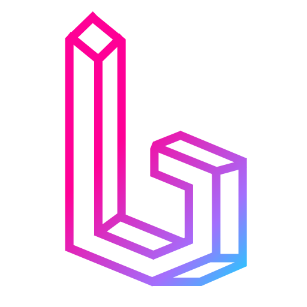
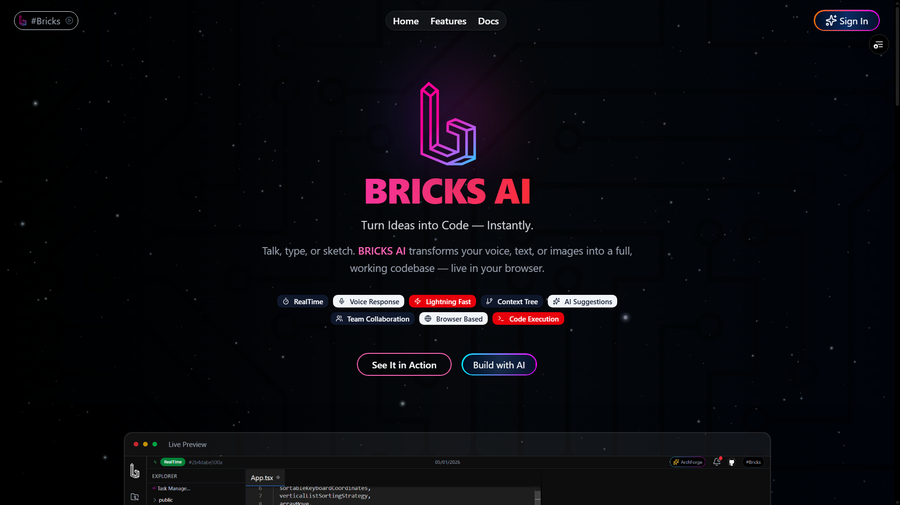
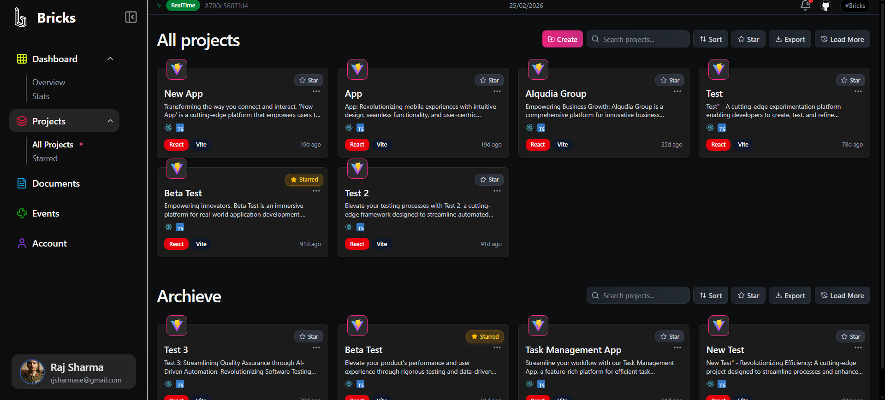
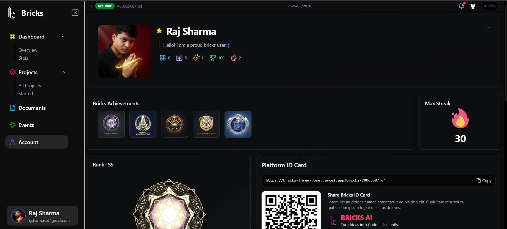
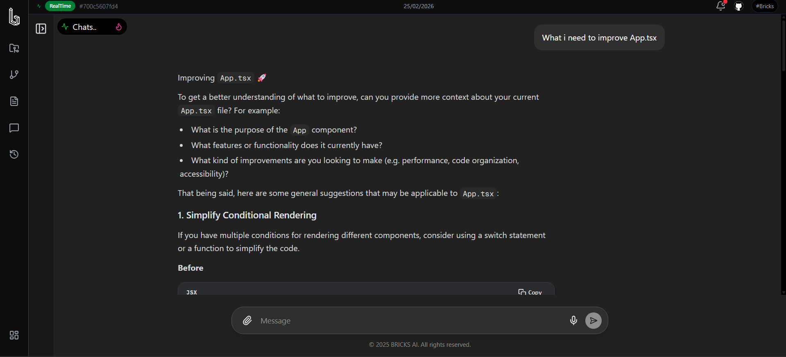
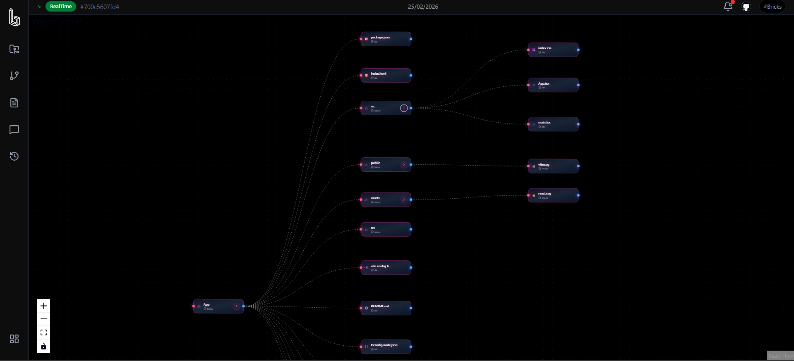
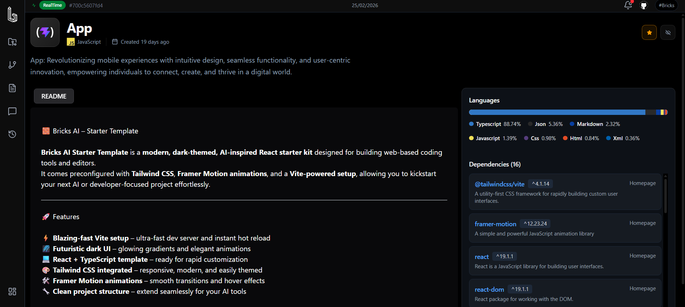
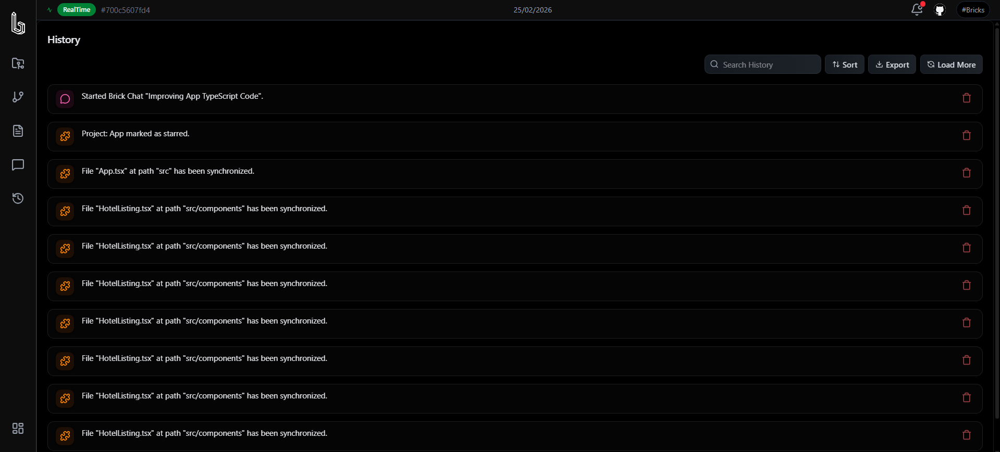

# 🚀 **BRICKS AI**

### **Transform Ideas → Code — Instantly**

*Revolutionary AI-powered IDE that turns voice, text, and images into functional applications — directly in your browser.*

---

## ✨ Overview

**Bricks AI** reimagines software creation by bridging imagination and implementation.
Our mission: *Empower anyone to build software using natural inputs like speech, sketches, and text.*

---

## 🎯 Core Innovation

* **🧠 Multi-Modal Intelligence** – Process voice, text, and visual inputs *(in development)*
* **⚡ Instant Prototyping** – Generate full-stack codebases in seconds
* **🌐 Zero-Setup Environment** – A complete development workspace running in your browser
* **🤝 Real-Time Collaboration** – Multi-user editing with live feedback

---

## 🧰 Development Suite

* **Monaco Editor** with intelligent auto-completion & syntax highlighting
* **Integrated Browser Terminal** for command execution
* **Live Preview** for instant UI feedback
* **Smart AI Assistance** for debugging and refactoring

---

## 📸 Live Product Gallery

> A quick visual tour of the Bricks AI experience.

### 🪄 Landing & Workspace

### 🧑‍🎓 Profile & Progress

### 🧑‍💻 Deep in the IDE

---

## 🌟 Key Features

### 🤖 AI-Powered Development

* Natural-language coding (“Describe your app in English”)
* Voice-to-Code *(in dev)*
* Image-to-App wireframe recognition *(in dev)*
* Context-aware AI suggestions
* AI-generated refactors, tests, and implementation hints

### ⚡ Performance & Scalability

* **WebContainer-based Runtime**: Node.js inside your browser
* **Low-latency Collaboration** with conflict resolution
* **Cloud-Native Backend** for enterprise scalability

### 🎨 Design, UX & Flow

* Clean, productive interface
* Fully responsive layout
* Dark / Light themes
* Accessibility-focused (WCAG compliant)
* Optimized multi-tab layout for dashboard, projects, chat, docs, and history

### 🏆 Profile, Achievements & Rank

* Rich profile with avatar, role, and skill focus
* Achievement-style milestones for shipped projects, collaboration, and activity
* Visual progress indicators for project count, streaks, and coding time
* Rank-style feeling through comparative stats and growth over time

---

## 🚀 Quick Start

1. Visit **[https://bricks-three-rose.vercel.app](https://bricks-three-rose.vercel.app)**
2. Sign up with your preferred provider
3. Start building using text, voice, or image input!

---

## 🏗️ Architecture & Tech Stack

### **Frontend**

Next.js 15.5 • React 19.1 • TypeScript 5.0 • Tailwind CSS 4.0

### **Development Tools**

Monaco Editor • WebContainer API • XTerm.js • Socket.io

### **Backend & Infrastructure**

Firebase • Redux Toolkit • Axios • Framer Motion

> 🧩 *Note: The Bricks AI backend (`bricks-backend`) is proprietary and closed-source.
> You can still interact with it via public APIs.*

---

## 🎉 Why Bricks AI?

### 👨‍💻 Developers

* 10× faster from concept → deployment
* No setup or installation required
* AI assistance and smart debugging
* Enterprise-grade coding tools

### 👥 Teams

* Real-time collaboration & integrated chat
* Git-based version control
* Built-in task management
* Secure, cloud-synced workspaces

### 🚀 Innovators

* Rapid prototyping for MVPs
* Cross-platform app generation
* Scalable architecture from day one
* Always updated with cutting-edge tech

---

## 🧪 Use Cases

* **Solo developers**: Spin up full-stack sandboxes, iterate quickly, and lean on AI for boilerplate and refactors.
* **Product teams**: Prototype flows and dashboards with live data, then hand off production-ready code.
* **Startups**: Validate ideas in days instead of weeks by going from prompt → working MVP.
* **Education & workshops**: Teach modern web development without any local setup.

---

## 🗺️ Roadmap

* 🎙️ **Voice-to-Code** – Dictate features and flows, let Bricks turn them into code.
* 🖼️ **Image-to-App** – Drop wireframes or screenshots, generate responsive layouts.
* 🧠 **Deeper Context Awareness** – Smarter refactors across large codebases.
* 🧩 **Template Library** – Pre-built app shells for dashboards, SaaS, internal tools, and more.
* 🛡️ **Team Admin & Analytics** – Advanced controls for orgs, usage insights, and audit trails.

---

## 🤝 Contributing

Contributions are welcome! This repository focuses on the **Bricks AI web client** – the backend remains proprietary but is exposed via public APIs.

If you’d like to contribute:

1. Fork the repo
2. Create a feature branch
3. Make your changes with clear, focused commits
4. Open a Pull Request with a concise description and screenshots if relevant

---

## 📄 License

This project is licensed under the **Apache License 2.0**.  
See the [`LICENSE`](LICENSE) file for full terms.

---

## 🌈 Ready to Build the Future?

**Built with ❤️ using Next.js, React, and cutting-edge AI.**

[**Open Bricks AI in your browser →**](https://bricks-three-rose.vercel.app)

© 2025 Raj.

