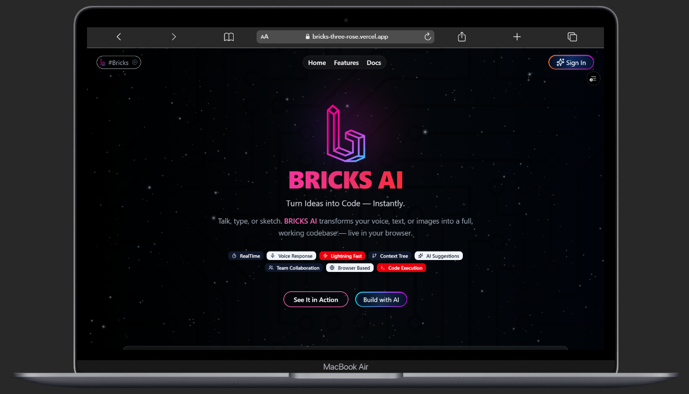
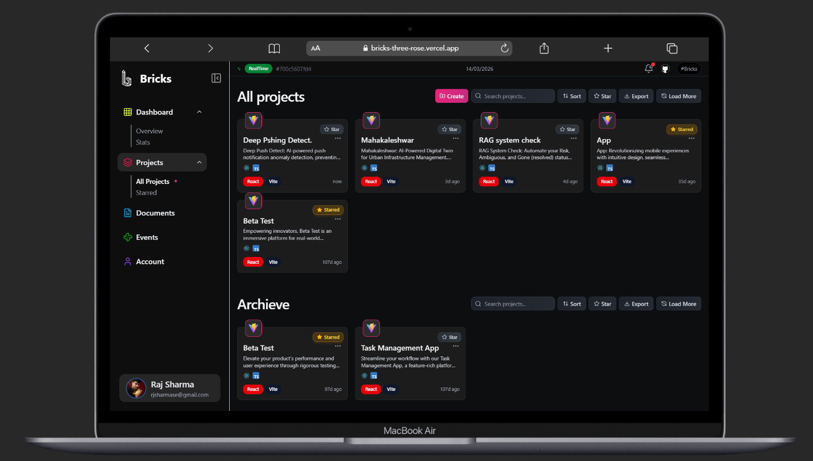
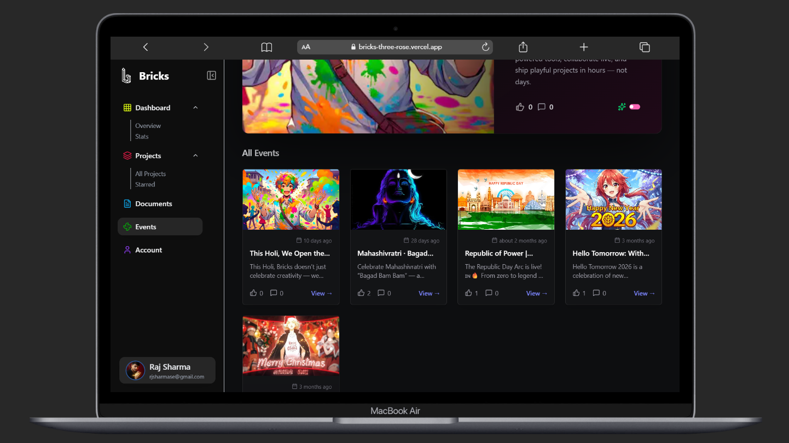
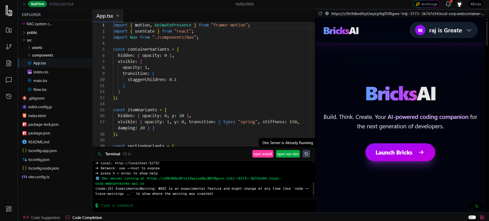
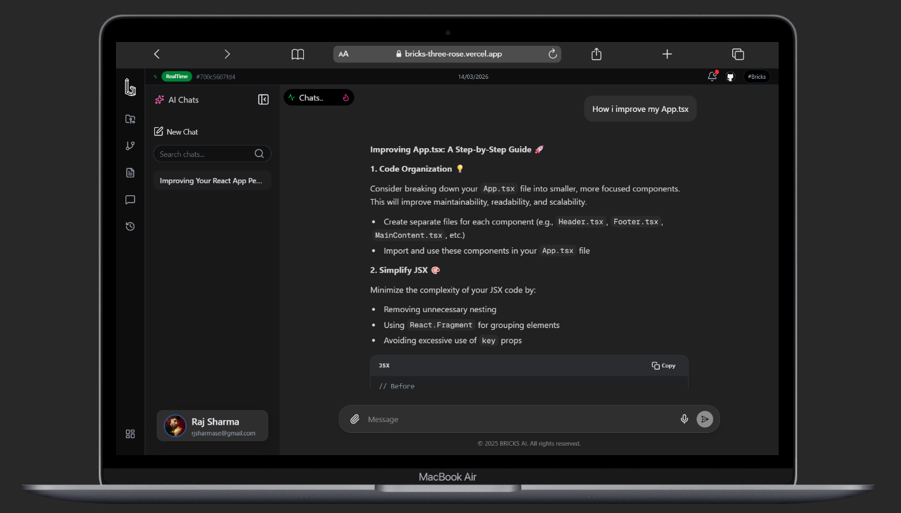
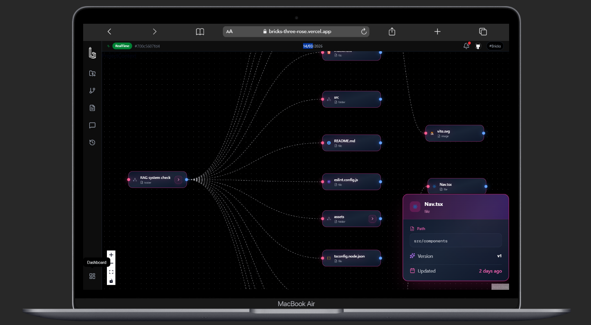
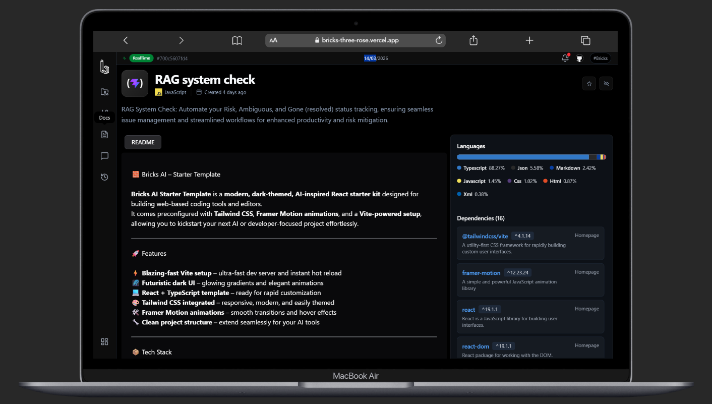
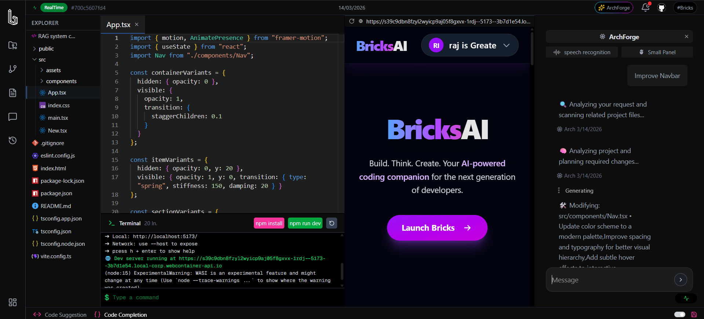
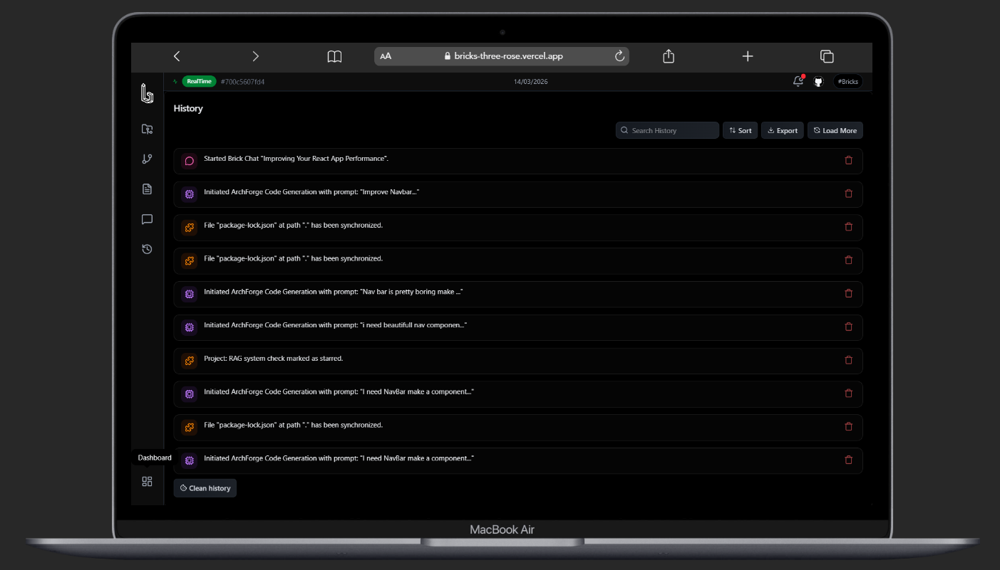
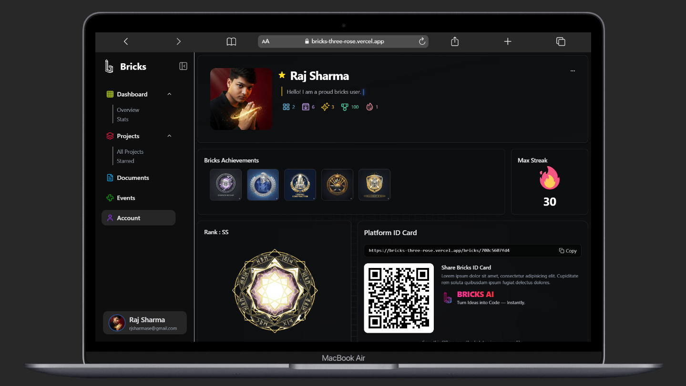

# 🚀 **BRICKS AI**

**Transform Ideas → Code — Instantly**

*Revolutionary AI-powered IDE that turns voice, text, and images into functional applications — directly in your browser.*

---

## ✨ Overview

**Bricks AI** is a next-generation web-based IDE that reimagines software creation by bridging imagination and implementation. Our mission is to empower anyone to build complete software solutions using natural inputs like speech, sketches, and text. No local environment setup, no dependency hell—just open your browser and start building natively.

 

## 🎯 Core Innovation

- **⚡ Instant Prototyping** – Generate full-stack codebases in seconds without writing a line of boilerplate.
- **🌐 Zero-Setup Environment** – A complete Node.js workspace running entirely in your browser using the WebContainer API.
- **🧠 Multi-Modal Intelligence** – Process text, constraints, and instructions fluidly. *(Voice/images in development)*.
- **🏆 Gamified Experience** – Build robust apps while earning streaks, ranks, and achievements.

 

## 📸 Product Gallery

> A visual tour of the Bricks AI experience, showcasing the powerful dashboard, intelligent IDE, and rich user features.

### 🪄 Landing & Dashboard

<strong>Click to view Landing Page & Dashboards</strong>

 

**Landing Page**

**All Projects Overview**

**Dashboard Events & Activity**

### 🧑‍💻 Deep inside the IDE

<strong>Click to view IDE Capabilities</strong>

 

**Main IDE Workspace**

**Intelligent AI Chat Assistant**

**Project Context & Work-Tree**

**Documentation Editor**

**System Architecture View**

**Action History & Revisions**

### 🧑‍🎓 Profile & Account Settings

<strong>Click to view Account Settings</strong>

 

**User Profile**

 

## 🌟 Key Features

### 🤖 AI-Powered Development
- **Natural-Language Coding**: Simply describe your app in English.
- **Context-Aware Assistance**: The AI knows your entire codebase, helping with debugging, explanations, and refactors.
- **Live Previews**: Instantly see your generated code visualized within a fully interactive browser tab.

### ⚡ Performance & Scalability
- **WebContainer Sandbox**: Lightning-fast, hyper-secure Node.js runtime executing directly in the client browser.
- **Interactive Terminal**: Full `XTerm.js` integration for running standard terminal commands, installing packages via `npm`, or managing Git locally.
- **Cloud-Native Backbone**: Optimized infrastructure ensuring non-blocking AI inferences.

### 🏆 Profile, Achievements & Rank Ecosystem
- **Engaging Profiles**: Dynamic user profiles with customizable avatars, developer roles, and specialized skill focus metrics.
- **Missions & Streaks**: Earn badges by shipping projects, keeping coding streaks alive, and pushing continuous activity.
- **Levelling System**: Visual rank progression giving a game-like comparative stat breakdown of your building journey over time.

### 🎨 Design & Productivity
- Beautiful, highly-optimized UI built with **Tailwind CSS V4** and **Radix UI/Framer Motion**.
- Fully resizable panels, tabbed navigation, and robust **Monaco Editor** integration featuring native Intellisense and syntactical auto-complete.
- Dark mode first, WCAG-compliant design packed with immersive micro-interactions.

 

## 🏗️ Architecture & Tech Stack

| Layer | Technologies |
| :--- | :--- |
| **Frontend Framework** | `Next.js 15.5` • `React 19.1` • `TypeScript 5` |
| **Styling & Animation** | `Tailwind CSS 4` • `Framer Motion` • `Radix UI` |
| **State Management** | `Redux Toolkit` • `React Query 5` |
| **Editor & Runtime** | `Monaco Editor` • `WebContainer API` • `XTerm.js` |
| **Diagrams & Visuals** | `React Flow` • `Dagre` • `Highlight.js` |

> 🧩 **Open Source Ecosystem:** 
> Both the Bricks client and [**Bricks Backend (`bricks-backend`)**](https://github.com/softenrj/Bricks-backend) are fully open-source. Feel free to explore, build entirely locally, or contribute to either repository!

 

## 🚀 Quick Start

1. Visit **[https://bricks-three-rose.vercel.app](https://bricks-three-rose.vercel.app)**
2. Sign up seamlessly with your preferred provider (GitHub / Google).
3. Open a new workspace workspace, enter a descriptive prompt, and watch the platform build it out!

*For local setup instructions for contributors, please refer to [`SETUP.md`](SETUP.md).*

 

## 🗺️ Roadmap

- [ ] 🎙️ **Voice-to-Code** – Dictate features to generate production-ready code.
- [ ] 🖼️ **Image-to-App** – Drop wireframes or UI mockups to automatically generate responsive React components.
- [ ] 🤝 **Real-Time Collaboration** – Seamless multi-user live editing, paired programming, and instant execution previews across team members.

 

## 🤝 Contributing

Contributions to the **Bricks AI Ecosystem** are highly welcomed and appreciated! Please read our [**Contributing Guide**](CONTRIBUTING.md) to get started on your open-source journey with us.

1. Fork the repo and create your feature branch.
2. Ensure you have the right setup by checking [`SETUP.md`](SETUP.md).
3. Commit with concise, descriptive messages.
4. Push your branch and open a Pull Request.

 

## 📄 License & Credits

This project is open-sourced and licensed under the **Apache License 2.0**.
See the [`LICENSE`](LICENSE) file for more information on rights and limitations.

 

### 🌈 Ready to Build the Future?

**Built with ❤️ using Next.js, React, and cutting-edge Gen-AI.**

[**🚀 Open Bricks AI in your browser**](https://bricks-three-rose.vercel.app)

© 2025 Raj. All rights reserved.

